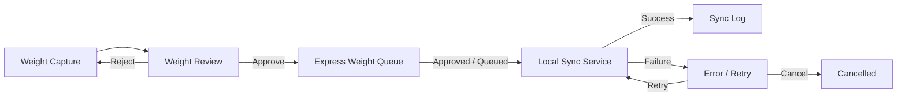

# 08 — Express Weight Write-back Design

> **Status:** DESIGN ONLY / SAFE MODE (Phase 2I)  
> **Target:** `tss-supply-chain-golive`  
> **Governance:** No production Express DBF write-back until explicit business and IT sign-off.

---

## 1. Workflow

| Step | Screen | Phase 2I behavior |
|------|--------|-------------------|
| 1 | Weight Capture | Operator enters gross/tare/net weight against SO/Pick Job. **Draft saved to localStorage only.** |
| 2 | Weight Review | Planner compares system qty vs captured weight, tolerance check. **Approve/Reject/Queue = safe-mode response only.** |
| 3 | Express Weight Queue | Items show target Express table/field mapping. **No sync execution.** |
| 4 | Express Weight Sync Log | Read-only audit trail of simulated actions. |
| 5 | Weight Error / Retry | Failed items with retry/cancel. **Retry does not connect to Express.** |

---

## 2. Governance Rule

Express weight write-back is **high risk** because it:

- Modifies Express DBF fields (`OESO`, related weight columns) outside WMS ledger controls
- Can desync billing, dispatch, and cold-chain compliance records
- Is difficult to roll back without coordinated Express + WMS audit

**Rule:** UI must never write DBF directly. All production writes must go through an approved **Local Sync Service** with queue, approval gates, and audit log.

Phase 2I implements UI structure and local mock service only (`EXPRESS_WEIGHT_SAFE_MODE = true`).

---

## 3. Why UI Must Not Write DBF Directly

| Risk | Reason |
|------|--------|
| No transaction boundary | Browser cannot participate in Express file locking |
| No rollback | Partial DBF updates corrupt SO weight vs WMS pick weight |
| No audit | Direct writes bypass queue log and approval |
| Security | Client-side code cannot hold Express credentials safely |
| Compliance | Weight changes require weighed-by, timestamp, and approver trace |

The golive UI is a **gate and review surface**. The sync service is the **only** component allowed to touch Express in production.

---

## 4. Queue Design

Each queue item contains:

| Field | Purpose |
|-------|---------|
| `queue_id` | Unique identifier |
| `source_doc` | SO / pick reference |
| `target_express_table` | e.g. `OESO` |
| `target_field` | e.g. `NET_WEIGHT`, `GROSS_WEIGHT` |
| `old_weight` | Value before write (for audit) |
| `new_weight` | Proposed value |
| `status` | Pending → Approved → Queued → Synced / Failed |
| `retry_count` | Increment on failure |
| `last_error` | Error message from sync service |

Status transitions in production require:

1. Capture submitted
2. Review approved (or auto-approve within tolerance)
3. Enqueued by authorized role
4. Sync service picks up item
5. Result logged; failure enters retry workflow

Phase 2I uses localStorage mock data in `expressWeightService.js`.

---

## 5. Required Future Tables (Supabase / backend)

| Table | Purpose |
|-------|---------|
| `sc_express_weight_capture` | Weight capture drafts and submitted records |
| `sc_express_weight_review` | Review decisions, tolerance, approver |
| `sc_express_weight_queue` | Queue items pending sync |
| `sc_express_weight_sync_log` | Immutable sync audit log |
| `sc_express_weight_error` | Failed items, retry metadata |

All tables must include: `created_at`, `created_by`, `updated_at`, `idempotency_key`, `safe_mode_flag` (for UAT).

---

## 6. Required Local Sync Service

A separate **Local Sync Service** (Node/Windows service or approved integration layer) must:

- Poll `sc_express_weight_queue` where `status = 'Queued'`
- Validate approval and tolerance gates
- Write to Express DBF via approved API/ODBC bridge (not from browser)
- Update queue status and append sync log
- Implement exponential backoff retry
- Never run unless `EXPRESS_WEIGHT_SAFE_MODE=false` and governance flag enabled

Phase 2I: **Not implemented.** UI simulates enqueue/retry responses only.

---

## 7. Approval Gates Before Production

Before disabling safe mode:

- [ ] Business sign-off on tolerance rules (±% by product category)
- [ ] IT sign-off on Express field mapping (`OESO` columns)
- [ ] Security review of sync service credentials
- [ ] UAT on queue → sync → log → rollback scenario
- [ ] Load test on retry storm / duplicate prevention
- [ ] Runbook for manual rollback and Express reconciliation
- [ ] Set `EXPRESS_WEIGHT_SAFE_MODE=false` only in production config after all gates pass

---

## 8. Rollback / Retry Rule

| Scenario | Action |
|----------|--------|
| Sync failed (timeout) | Increment `retry_count`, status → Queued, max 3 retries |
| Sync failed (validation) | Status → Failed, require manual review |
| Wrong weight synced | Rollback via compensating queue item (old ← new, new ← old) with separate approval |
| Cancel before sync | Status → Cancelled, no Express write |
| Duplicate enqueue | Reject via `idempotency_key` on `(source_doc, target_field)` |

All rollback operations must append to sync log with `action = ROLLBACK`.

---

## 9. Audit Log Requirement

Every state change must log:

- `queue_id`, `action`, `result`, `message`, `synced_at`, `service_name`, `actor`

Phase 2I `listWeightSyncLogs()` provides the UI structure; production logs must be **append-only** in `sc_express_weight_sync_log`.

---

## 10. Implementation Reference (Phase 2I)

| Item | Location |
|------|----------|
| Service (safe mode) | `src/services/expressWeight/expressWeightService.js` |
| Weight Capture | `src/features/warehouse/express-weight/WeightCapturePage.jsx` |
| Weight Review | `src/features/warehouse/express-weight/WeightReviewPage.jsx` |
| Express Weight Queue | `src/features/warehouse/express-weight/ExpressWeightQueuePage.jsx` |
| Sync Log | `src/features/warehouse/express-weight/ExpressWeightSyncLogPage.jsx` |
| Error / Retry | `src/features/warehouse/express-weight/WeightErrorRetryPage.jsx` |
| SCM preview source | `operationsExtensionService.js` (`express-queue` key) |

**Safe mode flag:** `EXPRESS_WEIGHT_SAFE_MODE = true` (hard-coded in service until governance approval).
