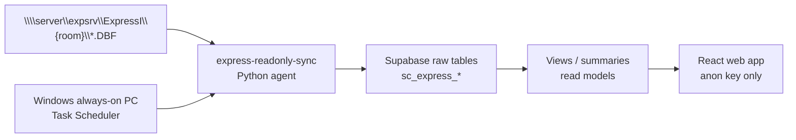

# Automated Express Sync Agent (Phase 3J)

## Purpose / วัตถุประสงค์

**English:** Automatically upload Express ERP data from NAS DBF files into Supabase on a schedule, without manually opening a computer and running sync commands.

**ไทย:** ให้ข้อมูล Express จากไฟล์ DBF บน NAS ถูก sync ขึ้น Supabase ตามตารางเวลา โดยไม่ต้องเปิดเครื่องและรันคำสั่งด้วยมือทุกครั้ง

**Safety:** Read-only toward Express. No DBF write-back. No stock posting. `SUPABASE_SERVICE_ROLE_KEY` is server-side only — never in React/Vite.

---

## Architecture



| Component | Role |
|-----------|------|
| `run_active_rolling_sync.bat` | Every 15 min — active rooms: STLOC + 2-month OESO/OESOIT/ARTRN |
| `run_master_daily_sync.bat` | Daily 02:00 — STMAS, ARMAS, STLOC |
| `run_historical_once_sync.bat` | One-time full sync for historical rooms |
| `run_refresh_read_models.bat` | Every 30 min — probe read models |
| `sync_state.json` | Local skip state for historical rooms |
| `sync_jobs` (Supabase) | Agent run timestamps for System Control |

---

## Why Supabase cannot directly read NAS DBF

Supabase (Postgres cloud) cannot mount `\\server\expsrv\ExpressI` or parse FoxPro DBF natively. A **local Windows agent** must:

1. Read DBF files read-only from the network share
2. Transform and upsert into Supabase via REST API
3. Run on a schedule via Task Scheduler

---

## Room policy

| Type | Rooms | Policy |
|------|-------|--------|
| **Historical** (one-time) | TSSN-68, TSS-68, TSSN-67, TSS-67 | Full sync once; skip after success; `--force` to re-run |
| **Active** (ongoing) | TSS, TSS-NV, CONSI | Full sync first time for transaction tables; then rolling 2 months |

---

## Required always-on machine

- Windows PC or VM that stays on 24/7
- Network access to `\\server\expsrv\ExpressI`
- Python venv at `scripts/express-readonly-sync/.venv`
- Outbound HTTPS to Supabase

---

## Required env file

Create `scripts/express-readonly-sync/.env`:

```env
SUPABASE_URL=https://YOUR_PROJECT.supabase.co
SUPABASE_SERVICE_ROLE_KEY=your_service_role_key_here
EXPRESS_DBF_PATH=\\server\expsrv\ExpressI\TSS
READONLY_MODE=true
SYNC_ROOM_CODE=TSS
```

**Security warning:** Never commit `.env`. Never put `SUPABASE_SERVICE_ROLE_KEY` in `.env.local` used by Vite or any `VITE_*` variable. The web app uses **anon key only**.

Validate:

```bat
cd scripts\express-readonly-sync
.venv\Scripts\python.exe automation\check_sync_env.py
```

---

## Recommended sync frequency

| Task | Schedule |
|------|----------|
| Active rolling sync | Every 15 minutes |
| Master daily sync | Daily at 02:00 |
| Read model refresh | Every 30 minutes |
| Historical once | Manual / one-time after install |

---

## How to install

1. Set up Python venv and `.env` (see `docs/20_EXPRESS_READONLY_SYNC_SETUP.md`)
2. Run historical once manually (optional, first time):

```bat
cd scripts\express-readonly-sync\automation
run_historical_once_sync.bat
```

3. Install Task Scheduler (Administrator PowerShell):

```powershell
cd scripts\express-readonly-sync\automation
powershell -ExecutionPolicy Bypass -File .\install_windows_task_scheduler.ps1
```

4. Open **Task Scheduler** → each task → Properties:
   - **Run whether user is logged on or not**
   - Use a **service account** with Express share read access
   - Confirm **Working directory** is `scripts\express-readonly-sync`

5. Verify on **System Control** → Automated Sync Agent section

---

## How to uninstall

```powershell
cd scripts\express-readonly-sync\automation
powershell -ExecutionPolicy Bypass -File .\uninstall_windows_task_scheduler.ps1
```

---

## How to check logs

Logs directory:

```
scripts/express-readonly-sync/logs/
```

Examples:

- `active_rolling_sync_YYYYMMDD_HHMMSS.log`
- `master_daily_sync_YYYYMMDD_HHMMSS.log`
- `historical_once_sync_YYYYMMDD_HHMMSS.log`

Status JSON:

```bat
.venv\Scripts\python.exe sync_status_check.py
```

---

## How to troubleshoot

| Symptom | Check |
|---------|--------|
| Agent mode = Unknown | Tasks not installed or never run; check Task Scheduler history |
| Last sync stays — | `.env` missing keys; run `check_sync_env.py` |
| NAS path errors | Service account lacks share access; test `dir \\server\expsrv\ExpressI\TSS` |
| Historical skipped | Expected after first success; use `--force` on manual run |
| Failed records > 0 | Query `sync_failed_records` in Supabase; see log files |
| Web shows old data | Confirm read models refresh; web reads views not raw tables |

---

## Manual commands (same as automation)

```bat
cd scripts\express-readonly-sync\automation
run_active_rolling_sync.bat
run_master_daily_sync.bat
run_historical_once_sync.bat
run_refresh_read_models.bat
```

Force historical re-sync:

```bat
cd scripts\express-readonly-sync
run_sync.bat --historical-rooms --table OESO.DBF --full --force
```

---

## Related docs

- `docs/20_EXPRESS_READONLY_SYNC_SETUP.md` — first-time sync setup
- `docs/21_EXPRESS_SYNC_UAT_VALIDATION.md` — data validation
- `docs/17_THAI_UAT_TEST_SCRIPT.md` — section "การทดสอบหลังเปิด Auto Sync"
- `scripts/express-readonly-sync/automation/README.md` — quick reference
